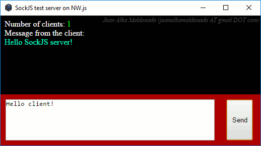

SockJS test server on NW.js 
============================ 
by Joan Alba Maldonado (joanalbamaldonadoNO_SPAM_PLEASE AT gmail DOT com, without NO_SPAM_PLEASE)

Just a simple [SockJS](https://github.com/sockjs "SockJS - WebSocket emulation") server running on [Node.js](https://nodejs.org/ "Node.js") but using [NW.js](https://nwjs.io/ "NW.js") (formely node-webkit).

Version: no version 
- Date: 29th July 2016 (approximately)

## Description

Just a simple [SockJS](https://github.com/sockjs "SockJS - WebSocket emulation") server running on [Node.js](https://nodejs.org/ "Node.js") but using [NW.js](https://nwjs.io/ "NW.js") (formely node-webkit) to provide a simple visual interface for testing purposes.

The default listening port is set to 9999 but can be modified easily.

It comes with a self-extracting single-file binary for Windows 32-bit (using [7zip](https://www.7-zip.org/links.html)'s SFX) that runs on Windows XP with SP2 (Service Pack 2) minimum and also on newer Windows versions as Windows 10 (generated with [Web2Executable](https://github.com/jyapayne/Web2Executable)) but also includes the source code so it can be ported to other platforms supported by [NW.js](https://nwjs.io/ "NW.js") easily.

## License

This project can be used, reproduced, distributed and modified freely for any non-commercial purposes but always keeping the author's name and copyright clauses. Other than that, just use this project as you wish but never sell it!